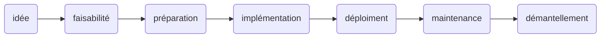
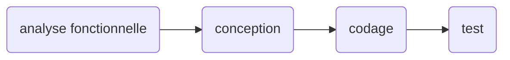
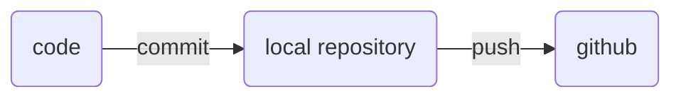

# Cycle de vie du logiciel #

## Description ##

- idée (durée : 1 jour, ... beaucoup plus): 
    - une idée de développement d'un logiciel, un - remplacement d'un logiciel existant 
- faisabilité (durée 1 semaine, ...): 
    - étudier la faisabilité du projet
    - établir un budget (ordre de grandeur)
    - est-ce rentable ?
- préparation (2 semaines - qlq mois):
    - préparer le projet
    - former l'équipe
    - définir l'architecture de base (langage, type d'application (web, desktop, ...)), les frameworks utilisés, la DB, ...
    - avoir une idée des fonctionnalités de l'application
- déploiement (1 jour, ...): déploiement en production de l'application
- maintenance (qlq semaines, 40 ans):
    - corriger les bugs
    - développer de nouvelles fonctionnalités
    - mettre à jour les librairies (sécurité)
- démantellement (1 jour, qlq semaines):
    - arrêter l'application

## Implémentation ##
- codage / programmation
- test
- intégration
- analyse
- conception

## Source Control ##
La gestion du code source.
On utilise git, mais il y a d'autres systèmes (subversion, mercurial).

Le flux quand on développe:

Mais avant, il faut initier le repository:

